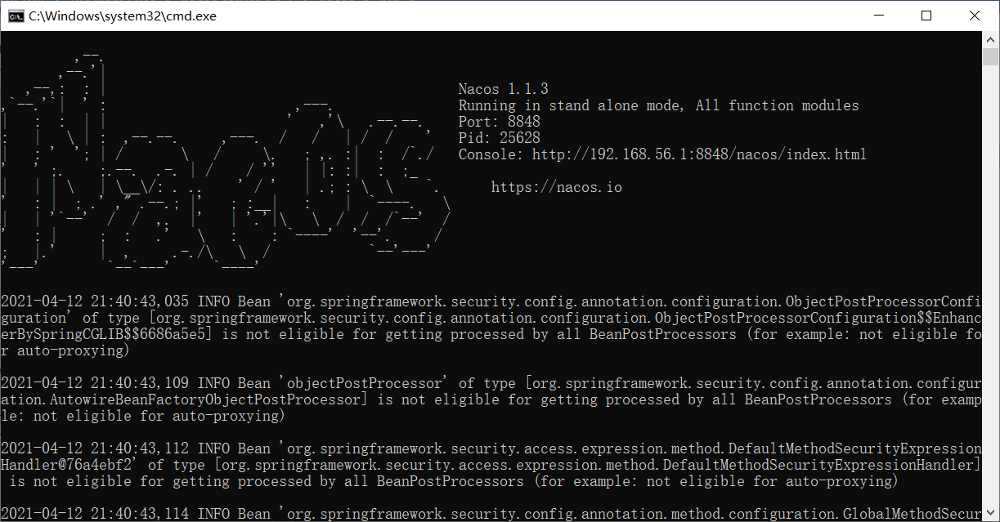
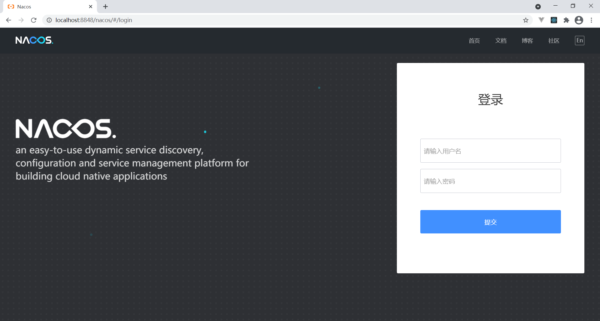

# 启动

nacos 下载地址：https://github.com/alibaba/nacos/releases

## windows

### 下载

下载 [nacos-server-1.1.3.zip](https://github.com/alibaba/nacos/releases/download/1.1.3/nacos-server-1.1.3.zip)

### 解压

随便找个地方解压

### 启动与停止

启动：进入解压文件的 `bin` 目录下，双击 `startup.cmd`

停止：进入解压文件的 `bin` 目录下，双击 `shutdown.cmd`

### 访问

http://localhost:8848/nacos

账号密码都是 `nacos` 

